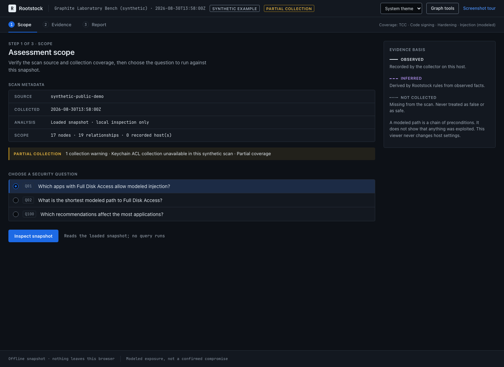
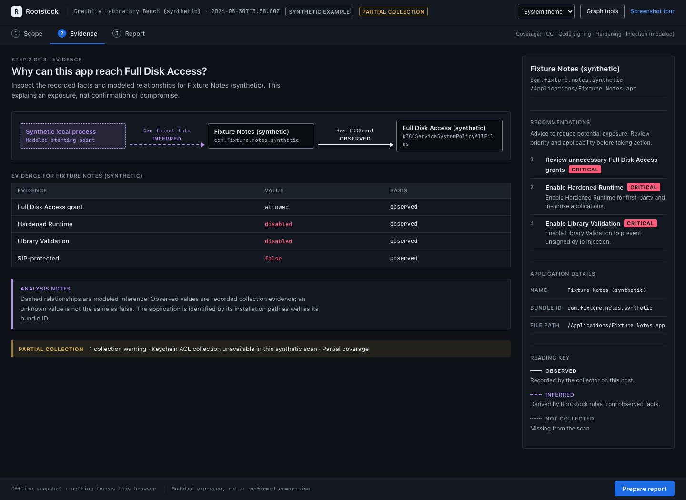
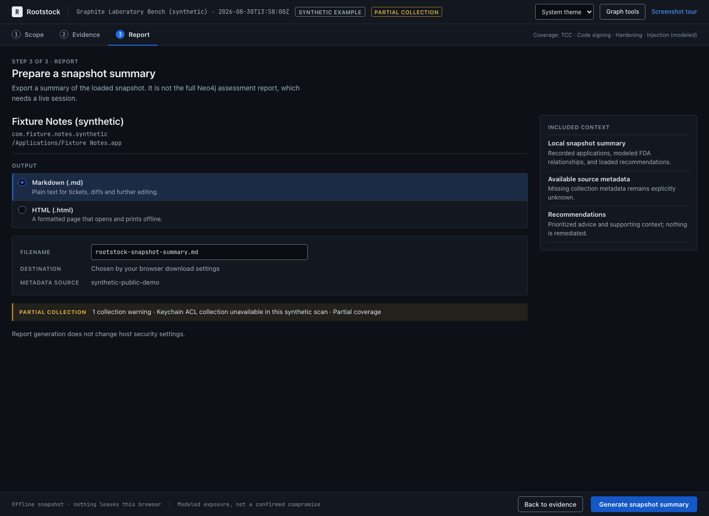
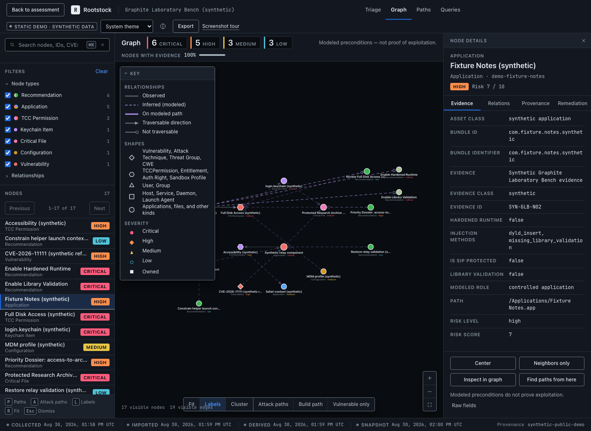

# Rootstock

Investigate macOS security exposure and its supporting evidence.

[](https://github.com/sebastianspicker/rootstock-macos/actions)
[](https://app.codacy.com/gh/sebastianspicker/rootstock-macos/dashboard)
[](https://www.bestpractices.dev/projects/13235)
[](https://scorecard.dev/viewer/?uri=github.com/sebastianspicker/rootstock-macos)

Rootstock helps you investigate macOS security exposure: which apps hold
sensitive permissions, which protections are missing, and how those facts
connect. It collects local metadata, builds a graph in Neo4j, and lets you
inspect the evidence in queries, reports, and a browser viewer.

The repository also includes independent tools for scoped CVE scanning,
read-only assessment, and offline incident analysis. Each has its own commands
and artifacts; you can use the component you need.

Alpha: `0.1.0-alpha.1`. Commands and schemas may change. Release archives
are not signed or notarized. Modeled paths describe possible exposure, not
confirmed exploitation.

[Try the interactive demo](https://sebastianspicker.github.io/rootstock-macos/) ·
[Read the docs](docs/README.md) · [Choose a component](#components)

## Screenshot tour

These are real browser captures of the viewer using a fictional dataset.
The [Pages demo](https://sebastianspicker.github.io/rootstock-macos/) needs no install,
scans no host, and connects to no database. Its
[screenshot tour](https://sebastianspicker.github.io/rootstock-macos/tour.html) walks
through the same flow.

### 1. Assessment scope

Verify the scan source and collection coverage, then choose the question to run.
The demo includes a missing-evidence warning so you can see how partial
collection is presented.



### 2. Read the evidence

Follow the modeled injection path to a fictional app with Full Disk Access.
Recorded values (observed), inferred relationships (violet), and recommendations
appear together so you can assess the basis for the finding.



### 3. Export a summary

Prepare a Markdown or HTML summary of the loaded snapshot. The full assessment
report uses the local Neo4j workflow; the demo export runs in your browser.



### 4. Explore the graph

Open **Graph tools → Graph** to search nodes and inspect relationships.
Use **Paths** to choose endpoints and trace a modeled route through the data.



See [Screenshot capture](docs/screenshots.md) to reproduce these images.

## Components

| Path | Purpose and runtime | Independent use | Documentation |
| --- | --- | --- | --- |
| `collector/` | Swift CLI that reads local macOS security metadata | Builds and runs independently; writes legacy `scan.json` | [Collector](collector/README.md) |
| `graph/` | Python package for Neo4j import, inference, reports, API, and viewer | Installed `rootstock-graph-*` commands | [Graph](graph/README.md) |
| `modules/cve-scan/` | Python CLI for CVE scanning within a declared scope | Runs independently; writes export schema v7 | [cve-scan](modules/cve-scan/README.md) |
| `rootstock-red/` | Swift assessment CLI and separate lab executable | Two independent executables | [Rootstock Red](rootstock-red/README.md) |
| `rootstock-blue/` | Swift offline DFIR and case-analysis CLI | Independent `.rsbcase` workflow | [Rootstock Blue](rootstock-blue/README.md) |
| `packages/RootstockMacFacts/` | Shared Swift paths, catalogs, and parsers | Library consumed by the Swift products | [RootstockMacFacts](packages/RootstockMacFacts/README.md) |
| `contracts/` | Interchange schemas and fixtures | Defines supported artifact formats | [Contracts](contracts/README.md) |

See [Architecture](docs/ARCHITECTURE.md) for dependency and runtime flows and
[Product family](docs/FAMILY.md) for supported handoffs.

## Requirements

| Component | Requirement |
| --- | --- |
| Collector | macOS 14+, Swift 6.3 from Xcode 26.6 |
| Graph | Python 3.10+, `uv`, Neo4j 5.x |
| cve-scan | Python 3.11+, `uv` |
| Red | macOS 13+, Swift 6.2+ |
| Blue | macOS 14+, Swift 6.2+ |
| Viewer | Node.js from `graph/viewer/.node-version`, npm 11.17.0 |

Python 3.11 is the tested version (repository development and CI). The graph
package declares Python 3.10 support, but 3.10 is untested. Install only the
environment needed for the component you are working on.

## Core quick start

Run these commands from the repository root. Build the collector and create a
local scan:

```sh
(cd collector && swift build -c release)
collector/.build/release/RootstockCLI --output scan.json
```

Create the locked graph environment and validate the artifact:

```sh
uv sync --project graph --locked --all-extras
uv run --project graph --locked rootstock-graph-validate-scan scan.json
```

Generate a password for a new local Neo4j database, start the bundled
loopback-only service, then run the pipeline:

```sh
export NEO4J_PASSWORD="$(python3 -c 'import secrets; print(secrets.token_urlsafe(32))')"
(cd graph && NEO4J_AUTH="neo4j/$NEO4J_PASSWORD" docker compose up -d --wait)
bash graph/pipeline.sh scan.json
```

Keep that password in a private local configuration. If you already have a
Neo4j data volume, use its existing password. The API also needs a bearer token
and a separate read-only database account; see
[Configuration](docs/CONFIGURATION.md). To explore without collecting host data,
start with the [synthetic examples](examples/README.md).

## Verification

Run the narrowest shared lane that covers the change:

```sh
sh scripts/verify release
sh scripts/verify swift-core
sh scripts/verify swift-family
sh scripts/verify graph
sh scripts/verify cve
sh scripts/verify web
sh scripts/verify shell
```

`sh scripts/verify neo4j` requires a running local Neo4j instance and separate
writer and reader credentials. `sh scripts/verify full` includes that
lane and fails if the service or any required tool is absent. See
[Quality gates](docs/QUALITY.md).

## Safety and data handling

- Core collection reads the local host at the time of the scan. Full Disk Access and
  Unix permissions are separate controls; unavailable evidence remains visible
  as partial results.
- Inferred paths model observed preconditions and do not prove exploitation.
- cve-scan uses the targets and permissions in your scope file. Review it
  before running: credential entries can execute commands.
- Red Lab requires an authorization acknowledgement and non-dry-run selection
  before making changes. You must obtain written authorization separately.
- Blue supports offline cases and synthetic event injection. It includes no
  live Endpoint Security client.
- Real scans, findings, reports, cases, tokens, database data, inventories, and
  derived screenshots are confidential and must not be committed.

## Project documentation

Start at the [documentation index](docs/README.md). Contributor workflow is in
[CONTRIBUTING.md](CONTRIBUTING.md), security reporting is in
[SECURITY.md](SECURITY.md), and release instructions are in
[Releasing Rootstock](docs/RELEASING.md).

The Core collector, graph, viewer, and root documentation are GPL-3.0.
`modules/cve-scan/` is MIT. Red, Blue, and RootstockMacFacts are Apache-2.0.
See the license file in each component and [CITATION.cff](CITATION.cff) for
citation metadata.
