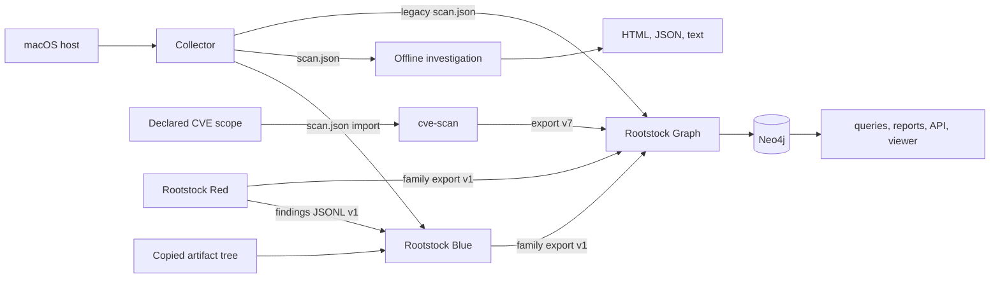
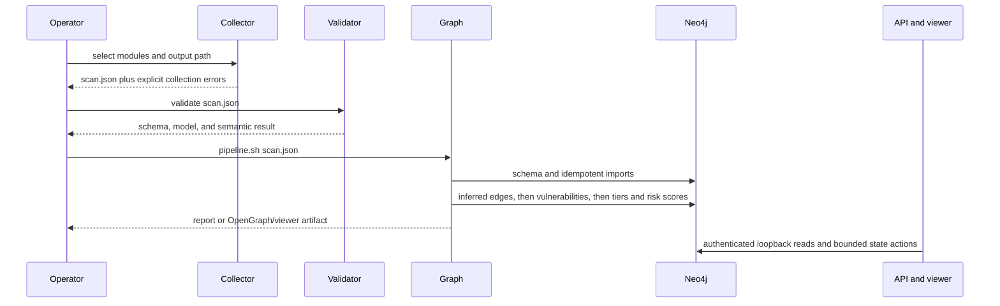

# Architecture

Rootstock separates host collection, graph analysis, CVE scanning, assessment,
and incident cases into independently built tools. They exchange the file
formats defined in [`contracts/`](../contracts/README.md).

## System context

Every arrow between products is an explicit file handoff. A Core graph run
does not invoke cve-scan, Red, or Blue. Blue keeps its case
records separately from Neo4j, and each export has its own format.

## Components

| Path | Responsibility | Data and dependencies |
| --- | --- | --- |
| `collector/` | Local Swift host collection | One target per data source (including `NetworkListeners`, `TrustSettings`, `BrowserExtensions` and `InstalledPackages`) plus `Models`, `Export`, `HostCommand`, `LaunchdPlists`, `FileACLInspection`, `SQLiteSupport`, and the CLI; writes one legacy, unversioned `scan.json`; no network collection path. |
| `graph/` | Python import, inference, queries, reports, and API in `src/rootstock_graph/`; viewer sources in the self-contained Node project `graph/viewer/` | Owns Neo4j graph state and packaged `rootstock-graph-*` commands. |
| `modules/cve-scan/` | Scoped CVE evidence collection and reporting | Owns run directories and a versioned graph export; no Neo4j dependency. |
| `rootstock-red/` | Read-only assessment (`RootstockCore`, `MacEnumKit`, `MacVulnKit`, `MacReportKit`) plus a separately linked lab (`RootstockLab`) | Owns findings and project artifacts; lab mutation uses operator self-attestation and dry-run controls. |
| `rootstock-blue/` | Offline DFIR case analysis and synthetic event exercises; targets in `Sources/RootstockBlue*` | Owns `.rsbcase` custody, JSONL, SQLite projection, and checksum semantics. |
| `packages/RootstockMacFacts/` | Neutral macOS paths, vocabulary, and parsers | Swift library only; no product serializer, graph/case state, or network client. |
| `contracts/` | Canonical cross-product schemas and fixtures | Each contract states its producer, consumers, version rule, and checker. |

These are independent build units with package-local manifests and locks. The
only local source-package dependency is `RootstockMacFacts`, consumed by the
collector, Red, and Blue. Python products communicate through artifacts, not
imports across project roots.

## Core runtime flow

The collector runs independent local data sources, retains recoverable
failures in the result, and serializes one `ScanResult`. Before import,
`rootstock-graph-validate-scan scan.json` (installed with the graph package)
checks the packaged collector-scan schema mirror, the Pydantic model, and
semantic constraints. `graph/pipeline.sh` then sequences
schema setup, optional CVE refresh, collector import, optional cve-scan import,
the inference edge stage, vulnerability import, the inference score stage, and
reporting. The CVE refresh (`--refresh-cve`) also matches the scan's installed
apps and macOS release against NVD by exact CPE and stores the results in the
offline cache `~/.rootstock/cache/nvd-installed.json`; the vulnerability import
reads that cache without network access. The vulnerability importer's category heuristics read inferred
relationships, and tier classification, risk scoring, and recommendations read
the CVE links, which is why inference is split around the import.

Python graph code lives in `graph/src/rootstock_graph/`. Foundation modules
(`category_predicates`, `constants`, `cypher`, `models`, `models_inventory`, `neo4j`, `paths`,
`server_validation`) sit below `vulnerability`, `ingestion`, `reporting`,
`api_support` (routes, schemas, dependencies), and `api`; `inference` sits on
the foundation and feeds `api_support`. The independent `investigation` layer
uses foundation, vulnerability and ingestion helpers to produce offline findings
and reports without a database. the private `graph/tests/test_architecture.py`
enforces the layering. Root-level graph files are orchestration or frontend
inputs, not Python command adapters. CLI commands are declared in
`graph/pyproject.toml`.

## Contracts and compatibility

| Artifact | Canonical contract | Producer | Consumers | Compatibility rule |
| --- | --- | --- | --- | --- |
| Collector scan | `contracts/collector-scan/legacy-unversioned.schema.json` | Collector | Graph, Blue | No in-place breaking change; introduce a new versioned artifact instead. Optional additions (such as the host inventory and settings collections) are additive and keep older scans valid. |
| CVE graph export | `contracts/cve-scan-export/v7/schema.json` | cve-scan | Graph | Reject unsupported schema versions and vocabulary. |
| Family open export | `contracts/family-open-export/v1/schema.json` | Red, Blue | Graph | Additive v1 evolution only; reject unsupported versions and endpoints. |
| Red findings JSONL | `contracts/red-findings-to-blue-jsonl/v1/` | Red | Blue | Preserve required finding fields; Blue may ignore additional fields. |

`scripts/check-contracts.py` validates canonical schemas, synthetic valid and
invalid fixtures, record invariants, and the packaged contract mirrors. For
the collector scan it also validates a golden fixture that the collector's Swift
tests keep byte-identical to real `JSONExporter` output, and requires that
fixture to exercise every schema property the encoder can emit.
`scripts/check-scan-contract-fields.py` aligns the collector schema's top-level
keys with graph model aliases and checks that the graph model accepts the
fixture. A contract change is incomplete until
its producer, every supported consumer, fixtures, checker, and compatibility
text agree.

## Storage and access

- Neo4j stores the imported and inferred graph. The bundled Compose service binds
  Browser and Bolt to loopback and persists data and logs in named volumes.
- The graph API refuses non-loopback API binds and Neo4j URIs. Every `/api/*`
  route uses the same bearer token. Ad-hoc Cypher is read-only and bounded;
  authenticated owned-marker and tier-classification endpoints change
  derived graph state.
- Static viewers embed a bounded OpenGraph payload. Live viewers start without
  graph data and use the authenticated local API. Viewer source is authored in
  `graph/viewer/src/` and `graph/viewer/css/`; packaged assets are generated
  under `graph/src/rootstock_graph/resources/viewer/`.
- Blue case packages own their manifest, custody and event JSONL, SQLite
  projection, checksum inventory, and interruption journal. Graph imports do
  not alter case custody.
- cve-scan scope files and Blue detection/content files are trusted operator
  inputs. A cve-scan credential command or configured Blue unified-log sidecar
  can execute another program with the current process identity.
- Real scans, reports, cases, findings, tokens, database volumes, inventories,
  and screenshots are confidential local artifacts.

See the full setting reference in
[Configuration](CONFIGURATION.md). Security assumptions and limitations are in
the [threat model](THREAT_MODEL.md).

## Build and release

There is no root language workspace. SwiftPM, Python, and Node environments are
resolved within their owning package: each Swift package has its own manifest,
each Python project its `uv.lock`, and the viewer its own `package.json`,
lockfile, and `.node-version` in `graph/viewer/` (`npm ci --ignore-scripts`,
then `npm run bundle`, `demo:build`, `demo:verify`, or `demo:screenshots`). The
root `package.json` is tools-only: it holds the repository-wide jscpd
duplication gate. Product-owned scripts live in the product
(`collector/scripts/`, `graph/scripts/`, `rootstock-blue/Tools/scripts/`); the
root `scripts/` directory holds only `verify` and the cross-product checkers.
`scripts/verify` runs the component checks; see [Quality gates](QUALITY.md).
Only the collector has a repository release-archive script
(`collector/scripts/build-release.sh`); Graph, cve-scan, Red, Blue, and
RootstockMacFacts remain source packages in the current Core alpha procedure.

The repository does not provide a supported remote graph service, fleet agent,
SIEM, EDR, MDM deployment, live Endpoint Security client, signing, or
notarization workflow.

## Extension rules

- Add collector evidence as a new data-source target that depends only on
  `Models` and, where needed, `HostCommand` (process execution),
  `LaunchdPlists`, `FileACLInspection`, or `RootstockMacFacts`; data-source
  targets do not depend on each other. Take shared macOS paths from
  `RootstockMacFacts.MacSecurityPaths`. Change the legacy contract only
  additively.
- Add graph code inside `rootstock_graph` in the layer that matches its
  dependencies (see above); no cross-module private imports or re-export
  facades. Declare console entry points in `graph/pyproject.toml`. Change the
  viewer in `graph/viewer/` and rebuild the committed bundle.
- Add cve-scan collectors only behind declared scope and coverage reporting.
- Add Red assessment modules through the documented module protocols: collectors
  and evidence helpers in `MacEnumKit`, checks and vectors in `MacVulnKit`,
  report formats in `MacReportKit`. Red's dependency order is `RootstockCore`,
  `MacEnumKit`, `MacVulnKit`, `RootstockRedCLI`. Lab actions remain in
  `RootstockLab`/`RootstockLabCLI`, which `rootstock-red` never links
  (`Scripts/check-no-lab-link.sh`), and must document writes and rollback.
- Add Blue parsers, collection packs, and detections with synthetic fixtures.
  A surface-marker parser is a spec for the single `SurfaceMarkerEngine`, with a
  private characterization golden in `Tests/RootstockBlueTests/Fixtures/surface-markers`;
  keep case mutations behind custody-aware APIs. Contract import and export
  live in `RootstockBlueInterchange`.
- Put only product-neutral Swift facts in `RootstockMacFacts`.
- Change a contract only with its producer, consumers, valid and invalid
  fixtures, `scripts/check-contracts.py`, and the version rule. For the
  collector scan this includes the encoder fixture
  `contracts/collector-scan/fixtures/valid-collector-encoder-complete.json`,
  regenerated with the locally installed private suite using
  `ROOTSTOCK_REGENERATE_FIXTURES=1 swift test --filter
  CompleteScanFixtureTests` from `collector/`, and the packaged mirrors under
  `graph/src/rootstock_graph/resources/contracts/`.

The [architecture decisions](design-docs/index.md) explain these choices.
Component READMEs link to their detailed architecture and extension guides.
