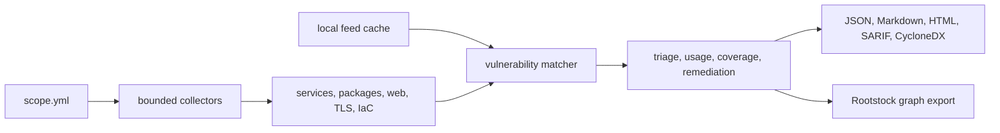

# cve-scan

`cve-scan` is a Python command-line tool for local CVE triage within a declared
infrastructure scope. It collects bounded evidence, matches it against local
vulnerability feeds, records gaps in coverage, and writes reports for people
and other tools.

Targets must be explicit, feeds are cached locally, and results retain the
evidence behind each match. The resulting graph export can be imported into
`rootstock-graph`. The scanner does not manage a vulnerability program or
validate exploitation.

> Alpha status: the current package version is `0.1.0a1`. CLI options, scope
> fields, report schemas, and graph-export fields may change.

## Requirements

- Python 3.11 or later
- `uv` for the locked source environment
- `shellcheck` only for the development script-lint command

## Quick start

From a source checkout, enter the module directory, sync the project lock, and
run the installed console entrypoint through `uv`:

```bash
cd modules/cve-scan
uv sync --locked --all-extras
uv run --locked cve-scan init
uv run --locked cve-scan update-feeds --cache /tmp/cve-scan-cache
uv run --locked cve-scan checks
uv run --locked cve-scan scan --scope examples/local-scope.yml --out /tmp/cve-scan-smoke --cache /tmp/cve-scan-cache
uv run --locked cve-scan report /tmp/cve-scan-smoke
uv run --locked cve-scan export-rootstock /tmp/cve-scan-smoke
```

You can also invoke the package as a Python module in the same locked
environment:

```bash
uv run --locked python -m cve_scan --help
```

The generated smoke scope probes localhost, inspects the parent repository,
leaves local Mac and Docker inventory disabled, and writes output under `/tmp`.
Create and review a project-specific scope before scanning anything beyond
this local test.

## What it does

- Reads targets, URLs, credentials, repository paths, and optional local
  collectors from one scope file, and scans only what that file declares.
- Collects service, TLS, web, repository manifest, host inventory, Mac
  inventory, Compose image, Docker image, dependency-path, and IaC or
  configuration evidence when enabled.
- Refreshes vulnerability data only through `update-feeds`. A scan reads the
  local cache and never refreshes it.
- Registers local mirrors of GitHub Advisory Database, GitLab Advisory
  Database, and CVE List V5 without copying those repositories into the cache.
- Writes JSON, Markdown, HTML, SARIF, CycloneDX SBOM and VDR, comparison
  reports, remediation queues, and the version 7 Rootstock CVE graph export.
- Adds local triage scores, asset context, remediation, coverage, usage, and
  evidence-quality metadata without making claims beyond the collected
  evidence.



## Outputs

Each scan directory can contain:

- `scan.json`: full scan record, findings, warnings, timings, cache metadata,
  coverage, queues, and enriched evidence.
- `findings.json`, `warnings.json`, `summary.md`, `summary.html`,
  `triage.md`, and `remediation.csv`.
- `findings.sarif` for code scanning integrations.
- `sbom.cdx.json` and `vdr.cdx.json` for CycloneDX consumers.
- `rootstock-export.json` with graph nodes and edges derived from the scan.
- `diff.json`, `diff.md`, and `diff.html` when `report --baseline` is used.

Import `rootstock-export.json` into Rootstock with:

```bash
uv run --project ../../graph --locked rootstock-graph-import-cve-scan \
  --input /tmp/cve-scan-smoke/rootstock-export.json
```

From the Rootstock repository root, the same artifact can be included in a full
collector pipeline run with:

```bash
NEO4J_PASSWORD=CHANGE_ME uv run --project graph --locked \
  bash graph/pipeline.sh examples/demo-scan.json \
  --cve-scan-export /tmp/cve-scan-smoke/rootstock-export.json
```

A compact [synthetic outcome](docs/example-outcome.md) shows the report format
without publishing a real network or project assessment.

## Scope files

Every scan starts from a strict scope file. Targets and repository paths must be
declared before they are touched. Aggressive web probes are disabled unless the
scope or CLI enables them, and each web entry keeps its own allowed domains,
allowed paths, request budget, and rule actions.

Treat a scope file as executable configuration. Credential entries can select
commands used as local WinRM helpers or remote SSH collection commands. Run
only scope files you own or have reviewed, and do not execute one directly from
an untrusted branch, pull request, or download.

```yaml
name: local-smoke
scan_profile: standard
aggressive_web: false
request_budget: 20
rate_limit_per_second: 10
max_cidr_hosts: 16
max_manifest_depth: -1
exclude_hosts: []
exclude_paths: []
local_inventory:
  homebrew: false
  python_global: false
  npm_global: false
container_inventory:
  local_docker: false
targets:
  - host: 127.0.0.1
    ports: [1, 80, 443]
web:
  - url: http://127.0.0.1/
    allowed_domains: [127.0.0.1]
    allowed_paths: [/]
    profile: passive-baseline
    collect_javascript_inventory: true
    web_rules:
      web.missing-security-header: warn
      web.exposed-server-header: info
repo_paths:
  - ..
```

Scan profiles are `quick` and `standard`. The `quick` profile leaves the
declared targets unchanged, reduces collection work, keeps web probing passive,
and loads only relevant feed index shards where possible. A scope file records
the intended boundary but cannot verify that you are authorized to scan it.

The [architecture guide](docs/architecture.md) describes the stage boundaries
and failure model.

## Commands

```bash
uv run --locked cve-scan --help
uv run --locked cve-scan init
uv run --locked cve-scan update-feeds
uv run --locked cve-scan update-feeds --dry-run
uv run --locked cve-scan update-feeds --online
uv run --locked cve-scan update-feeds --github-advisory-dir /path/to/advisory-database
uv run --locked cve-scan update-feeds --gitlab-advisory-dir /path/to/advisories-community
uv run --locked cve-scan update-feeds --cve-list-v5-dir /path/to/cvelistV5
uv run --locked cve-scan checks
uv run --locked cve-scan scan --scope examples/local-scope.yml --out runs/local
uv run --locked cve-scan scan --profile quick --scope examples/local-scope.yml --out runs/quick
uv run --locked cve-scan report runs/local
uv run --locked cve-scan report runs/local --baseline runs/previous
uv run --locked cve-scan export-rootstock runs/local
```

## Development

The package has no third-party runtime dependencies. From the repository root,
run its lint, tests, smoke checks, and packaging checks in the locked
environment with:

```bash
sh scripts/verify cve
```

Run directories and reports inherit permissions from their parent directory
and the process umask. Use a private directory for real scopes and evidence.
Scope YAML, feed caches, mirror directories, and imported asset context are
trusted inputs. See the [security policy](SECURITY.md).

## License

MIT. See [LICENSE](LICENSE).
