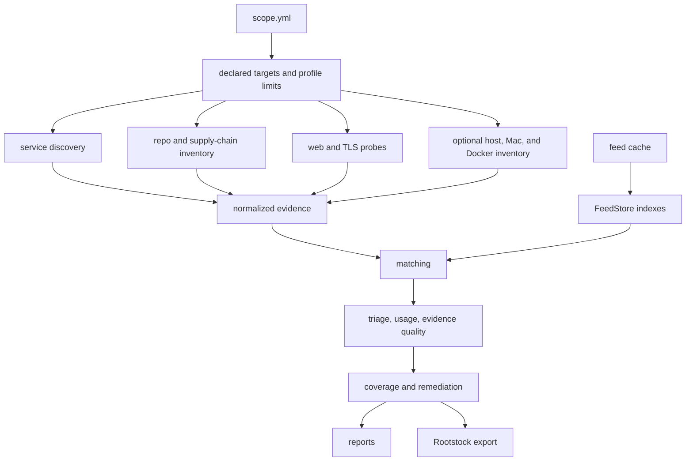
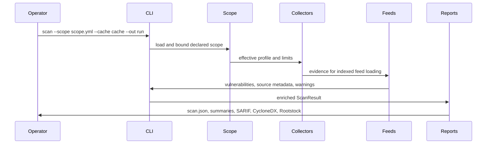

# Architecture

`cve-scan` passes explicit data between six stages: scope parsing, evidence
collection, feed loading, matching, enrichment, and reporting.

## Core boundaries

- `scope` parses and bounds the declared targets before any collector runs. It
  records the scan boundary but cannot verify external authorization.
- Collectors emit normalized services, packages, web observations, certificates,
  warnings, and config findings.
- `FeedStore` loads local vulnerability data and indexes package names, PURLs,
  CPEs, and products.
- Matching creates findings with explicit evidence and feed provenance.
- Report enrichment adds triage scores, usage signals, evidence quality,
  coverage records, remediation bundles, and owner and SLA queues.
- Report writers serialize the same result into JSON, Markdown, HTML, SARIF,
  CycloneDX, and Rootstock graph formats.

## Data flow

## Design choices

- Scans use local feeds. Network access for a feed refresh is explicit and
  separate from scan execution.
- Active web behavior is bounded by declared domains, paths, request budgets,
  and profile settings.
- The scanner records uncertainty. Gaps in coverage, unsupported data shapes,
  missing advisory coverage, malformed cache entries, and failed optional
  collectors become warnings or coverage entries.
- The Rootstock export contains graph nodes and edges supported by the scan
  evidence. `rootstock-graph` performs the broader relationship analysis.
- The package keeps its runtime dependency-free while its local parsers cover
  the supported formats.

## Feed and report invariants

- A feed update validates staged source data and index shards before selecting
  the new cache generation.
- A scan uses one validated cache generation. Missing, stale, or inconsistent
  metadata is rebuilt from that generation's source files.
- Advisory aliases are merged deterministically while preserving source
  precedence and provenance.
- Usage, evidence quality, triage, remediation, and coverage are finalized
  before the result is rendered into different output formats.
