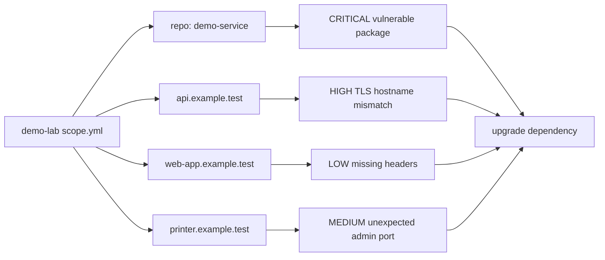

# Synthetic example outcome

This page shows a possible `cve-scan` result using mock data. It contains no
real network, repository, or organization assessment. The hostnames, IP
addresses, package names, and CVE identifiers are illustrative placeholders.

## Scenario

A small synthetic lab scope contains:

- three declared hosts on documentation-only addresses
- two web surfaces with bounded passive and active checks
- one repository path with dependency manifests
- a local feed cache built from NVD, CISA KEV, and one advisory mirror
- no authenticated host or SMB inventory



## Example summary

| Metric | Example value |
| --- | ---: |
| Services | 7 |
| Certificates | 2 |
| TLS observations | 2 |
| Packages | 48 |
| Web observations | 18 |
| Findings | 5 |
| Warnings | 2 |

| Severity | Count |
| --- | ---: |
| CRITICAL | 1 |
| HIGH | 1 |
| MEDIUM | 1 |
| LOW | 2 |
| INFO | 0 |

## Example findings

| Severity | Target | Rule or ID | Evidence | Suggested next action |
| --- | --- | --- | --- | --- |
| CRITICAL | `pkg:pypi/demo-framework@2.4.1` | `CVE-20XX-0001` | Package coordinate matched local advisory cache; synthetic application context came from `assets.csv`. | Upgrade to `2.4.7` or later, rerun the dependency scan, and record the synthetic result. |
| HIGH | `api.example.test:443` | `tls.hostname-mismatch` | Certificate subject only covers `legacy-api.example.test`. | Reissue certificate with the active service name and verify from the client network. |
| MEDIUM | `192.0.2.30:8443` | `service.unexpected-admin-port` | HTTPS-like service found on a port not declared in the asset inventory. | Confirm owner and purpose; restrict source networks if it is an admin surface. |
| LOW | `https://web-app.example.test/` | `web.missing-security-header` | `content-security-policy` absent from baseline response. | Add a policy in report-only mode first, then enforce after checking breakage. |
| LOW | `https://web-app.example.test/` | `web.missing-security-header` | `x-content-type-options` absent from baseline response. | Add `X-Content-Type-Options: nosniff`. |

## Example coverage and blind spots

| Area | Status | Reason |
| --- | --- | --- |
| Declared TCP targets | Covered | All declared hosts and ports were probed within scope limits. |
| Web baseline checks | Covered | Allowed domains and paths were explicit; request budget was not exhausted. |
| Repository manifests | Covered | Python and npm manifests were parsed inside the declared repo path. |
| Authenticated host inventory | Not covered | No credentials were provided in the synthetic scope. |
| Full network sweep | Not covered | The scope declared individual targets, so the scanner did not discover or probe other hosts. |
| Exploit validation | Not covered | `cve-scan` reports evidence and remediation hints; it does not run exploit templates. |

## Example remediation queue

| Priority | Bundle | Why grouped | Verification hint |
| --- | --- | --- | --- |
| 1 | Patch `demo-framework` | Critical package match in the synthetic application. | Confirm package version in the synthetic lockfile and SBOM output. |
| 2 | Reissue API certificate | User-visible TLS trust failure. | Rerun scan and confirm hostname match. |
| 3 | Review admin service | Unexpected management surface. | Confirm asset owner, firewall policy, and intended exposure. |
| 4 | Add web headers | Same web asset, low-risk hardening. | Rerun web probe and compare `summary.md`. |

## Example machine-readable excerpt

The real `scan.json` is more detailed. A compact excerpt from this synthetic
run would look like this:

```json
{
  "scope_name": "demo-lab",
  "scan_profile": "standard",
  "counts": {
    "services": 7,
    "packages": 48,
    "findings": 5,
    "warnings": 2
  },
  "finding_severities": {
    "CRITICAL": 1,
    "HIGH": 1,
    "MEDIUM": 1,
    "LOW": 2,
    "INFO": 0
  },
  "outputs": [
    "scan.json",
    "summary.md",
    "summary.html",
    "findings.sarif",
    "sbom.cdx.json",
    "vdr.cdx.json",
    "rootstock-export.json",
    "remediation.csv"
  ]
}
```

## Read the result

Review the report in four steps:

1. Check whether the scope and blind spots match the intended authorization.
2. Triage high-severity findings against asset context and usage evidence.
3. Apply the smallest remediation that changes the observed evidence.
4. Rerun the same scope and compare the new report against the baseline.

The report should make the evidence and next action clear without implying
exploitability, compliance coverage, or complete network visibility from a
bounded local scan.
